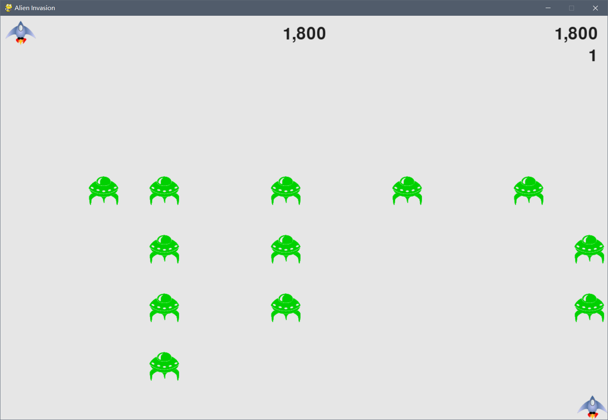

# 《Python程序设计基础》程序设计作品说明书

题目： 外星人入侵

学院： 21计科03

姓名： 欧阳浩

学号： B20210302325

指导教师： 周景

起止日期：2023.11.10-2023.12.10

## 摘要

本次主要完成了书本上外星人入侵项目的代码，实现了12、13、14章的功能

关键词：python、pygame、alien_invasion

## 第1章 需求分析

游戏概述：类似于早期的雷霆战机游戏，玩家可以使用键盘上的a键或d键来控制左右移动，空格键射击子弹并击杀外星人。
实现的功能：驾驶飞船、射击子弹、外星人移动、可以射杀外星人、结束游戏、play按钮、提高等级、计分

## 第2章 分析与设计

_本章的内容主要包括系统的设计，例如：系统架构、系统流程、系统模块、数据库的设计，以及关键的实现，例如：使用的数据结果、算法。_
关键实现思路如下：
### 设置屏幕大小、游戏名称、背景颜色
```python
pygame.init()  #初始化背景设置
    ai_settings = Settings()
    screen = pygame.display.set_mode((120, 800))
    pygame.display.set_caption("外星人入侵")
```
### 鼠标和键盘监听事件
```python
def check_events(ai_settings,screen,ship,bullets):
    """ 响应按键和鼠标事件，在这个方法中指定需要检查的事件 """
    # 事件都是通过pygame.event.get()方法获取
    for event in pygame.event.get():
        if event.type == pygame.QUIT:
            sys.exit()
         # 每次按键都会注册一个KEYDOWN
         # 检测到KEYDOWN事件时，我们需要检查按下的是否是特定的键
        elif event.type == pygame.KEYDOWN:
            check_keydown_events(event,ai_settings,screen,ship,bullets)
        # 松开方向键时触发的事件，将moving_right or moving_left设为false
        elif event.type == pygame.KEYUP:
            check_keyup_events(event,ship)
```

### 加载图片，添加图片
以ship.py做例子：
代码如下：
```python
class Ship():
    def __init__(self,ai_settings, screen):
        """ 初始化飞船设置其初始化位置"""
        self.screen = screen
        self.ai_settings = ai_settings
        # 加载飞船图像并获取其外接矩形
        self.image = pygame.image.load('images/ship.bmp')
        self.rect = self.image.get_rect() 
        self.screen_rect = screen.get_rect()
        #将每艘新飞船放在屏幕底部中央
        self.rect.centerx = self.screen_rect.centerx
        self.rect.bottom = self.screen_rect.bottom
        # 在飞船的属性center中存储小数值
        self.center = float(self.rect.centerx)
        # 添加一个向右移动的属性 初始化为False
        # 在向右键按下时，为真，松开为False，实现按住持续移动
        self.moving_right = False
        self.moving_left = False
```
ship.py中，我通过pygame.image.load()函数加载图片，存放图片素材的文件最好与ship.py在同一级目录。
self.image.get_rect() 是获取图片所占用的矩形，此后就像操作一个矩形一样操控图片，简单快捷高效。
screen.get_rect() 同理就是获取屏幕的矩形。
两个获取的矩形rect其实都是为了获取对象的参数，方便设置位置等。可用使用矩形的四角和中心(x,y)坐标来设置图片的位置。
rect的对象还有center，centerx，centery属性。

### 事件响应
以响应a键和d键做例子：
```python
def check_keydown_events(event, ai_settings, screen, ship, bullets):
    """响应按键按下"""
    if event.key == pygame.K_RIGHT:
        ship.moving_right = True
    elif event.key == pygame.K_LEFT:
        ship.moving_left = True
    elif event.key == pygame.K_SPACE:
        fire_bullet(ai_settings, screen, ship, bullets)
    elif event.key == pygame.K_q:
        sys.exit()


def check_keyup_events(event, ship):
    """响应按键抬起"""
    if event.key == pygame.K_RIGHT:
        ship.moving_right = False
    elif event.key == pygame.K_LEFT:
        ship.moving_left = False

def update(self):
        if self.moving_right and self.rect.right < self.screen_rect.right:
            self.center += self.ai_settings.ship_speed_factor
        if self.moving_left and self.rect.left > 0:
            self.center -= self.ai_settings.ship_speed_factor
```
我在这里使用if语句来检测event变量的key元素是否和指定的变量值相等，如果相等则改变对应的事件标志，事件标志会在function函数里响应事件标志的变化来实现想要的操作，如按下<-键时检测到event.key与指定给的pygame.K_RIGHT中存储的值也就是键盘上<-键的事件编码，此时设置事件标志ship.moving_left为真，则在ship.py文件中的update函数检测到事件标志为真，通过让飞船中心左移指定的速度变量值来实现飞船的向左移动

## 第3章 软件测试

由于我做的是一个游戏，无法通过截图就显示全所有功能，所以我这里放上几张关键功能的实现图来作为测试的效果图：
### 初始界面：

### 外星人移动：

### 击杀和得分：

### 失去生命值：

### 记录得分：

## 结论

在这次实验中我通过学习书上的项目来实现了一个外星人入侵的pygame游戏项目，主要使用到了事件监听、实现图形数据模型、实现图片与实体相结合移动等关键实现，通过这次的几百行python代码锻炼，我提高了自己的输入能力、对python函数的运用、加深了我对python中类的理解，综合提升了我自己的能力水平。

## 参考文献
[1] [美]Eric Matthes.Python编程：从入门到实践[M]. 北京：人民邮电出版社，2023.