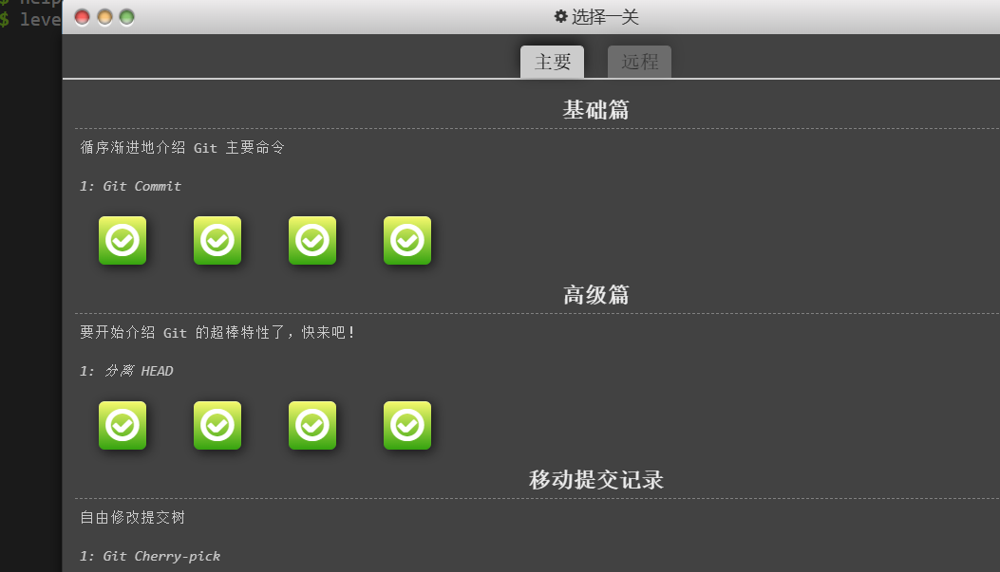
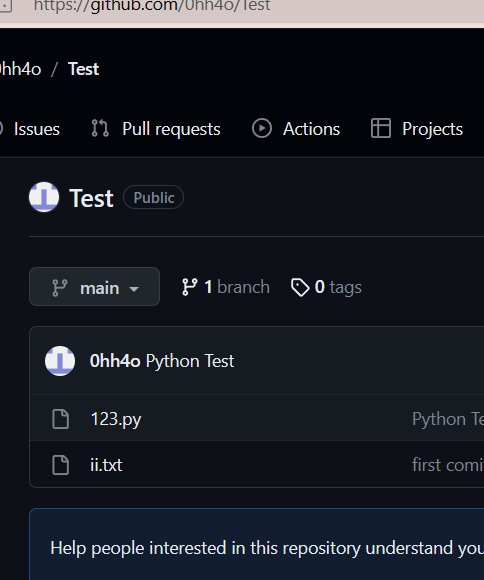

# 实验一 Git和Markdown基础
班级：21计科03
学号：B20210302325
姓名：欧阳浩
Github地址：https://github.com/0hh4o/python_course
## 实验目的
    1.Git基础，使用Git进行版本控制
    2.Markdown基础，使用Markdown进行文档编辑
## 实验环境
    1.Git
    2.VSCode
    3.VSCode插件
## 实验内容和步骤
### 第一部分 实验环境的安装
    1.安装git，从git官网下载后直接点击可以安装：[git官网地址](https://git-scm.com/)
2. 从Github克隆课程的仓库：[课程的Github仓库地址](https://github.com/zhoujing204/python_course)，[课程的Gitee仓库地址](https://gitee.com/zj204/python_course)，运行git bash应用（该应用包含在git安装包内），在命令行输入下面的命令（命令运行成功后，课程仓库会默认存放在Windows的用户文件夹下）

```bash
git clone https://github.com/zhoujing204/python_course.git
```

或者从gitee克隆课程的仓库：
```bash
git clone https://gitee.com/zj204/python_course.git
```

如果你在使用`git clone`命令时遇到SSL错误，请运行下面的git命令(这里假设你的Git使用了默认安装目录)：

```bash
git config --global http.sslCAInfo C:/Program Files/Git/mingw64/ssl/certs/ca-bundle.crt
```

该仓库的课程材料后续会有更新，如果需要更新课程材料，可以在本地课程仓库的目录下运行下面的命令：

```bash
git pull
```

3. 注册Github账号或者Gitee仓库，创建一个新的仓库，用于存放实验报告和实验代码。
4. 安装VScode，下载地址：[Visual Studio Code](https://code.visualstudio.com/)
5. 安装下列VScode插件
   - GitLens
   - Git Graph
   - Git History
   - Markdown All in One
   - Markdown PDF
   - Auto-Open Markdown Preview
   - Paste Image
   - markdownlint

### 第二部分 Git基础

教材《Python编程从入门到实践》P440附录D：使用Git进行版本控制，按照教材的步骤，完成Git基础的学习。

### 第三部分 learngitbranching.js.org

访问[learngitbranching.js.org](https://learngitbranching.js.org)，如下图所示完成Main部分的Introduction Sequence和Ramping Up两个小节的学习。

上面你学习到的git命令基本上可以应付百分之九十以上的日常使用，如果你想继续深入学习git，可以：

- 继续学习[learngitbranching.js.org](https://learngitbranching.js.org)后面的几个小节（包括Main和Remote）
- 在日常的开发中使用git来管理你的代码和文档，用得越多，记得越牢
- 在git使用过程中，如果遇到任何问题，例如：错误删除了某个分支、从错误的分支拉取了内容等等，请查询[git-flight-rules](https://github.com/k88hudson/git-flight-rules)

### 第四部分 Markdown基础

查看[Markdown cheat-sheet](http://www.markdownguide.org/cheat-sheet)，学习Markdown的基础语法

使用Markdown编辑器（例如VScode）编写本次实验的实验报告，包括[实验过程与结果](#实验过程与结果)、[实验考查](#实验考查)和[实验总结](#实验总结)，并将其导出为 **PDF格式** 来提交。

## 实验过程与结果
Git网页学习截图：

Github仓库截图：

### 附录D 使用Git进行版本控制

配置Git

```bash
git config --global user.name "username"
git config --global user.email "email"
```


### learngitbranching.js.org练习

Introduction to sequence
1. git commit
git commit提交了一个新的commit，这个commit包含了当前工作目录的状态。这个commit的父节点是当前分支的最新commit。


```bash
git commit
git commit
```

## 实验考查

请使用自己的语言回答下面的问题，这些问题将在实验检查时用于提问和答辩，并要求进行实际的操作。

1. 什么是版本控制？使用Git作为版本控制软件有什么优点？
版本控制（Revision control）是一种在开发的过程中用于管理我们对文件、目录或工程等内容的修改历史，方便查看更改历史记录，备份以便恢复以前的版本的软件工程技术。
Git分布式版本控制系统的优势如下：

独立性：Git不需要依赖中央服务器来存储版本历史，因此用户可以随时随地访问和更新代码库。用户可以随时从任何位置开始一个新分支，进行修改，然后将其推送到网络上的存储库，而无需等待其他人的批准或中央服务器的响应。
实时性：Git的分布式特性使得用户可以实时地查看和更新代码库。用户可以在本地计算机上工作，并将更改推送到网络上的存储库，而无需等待其他人的批准或中央服务器的响应。
灵活性：Git的分布式特性使得用户可以自由地组织和管理代码库。用户可以将代码库分成多个存储库，并自由地将更改推送到这些存储库。用户还可以使用Git的分支功能来跟踪和管理不同的代码版本。
安全性：Git的分布式特性可以保护用户的数据免受中心化服务器的攻击。用户的更改是本地化的，不会受到中心化服务器的审查和控制。
高效性：Git的分布式特性可以提高开发效率。用户可以在本地计算机上并行处理多个更改，而无需等待其他人的批准或中央服务器的响应。

2. 如何使用Git撤销还没有Commit的修改？如何使用Git检出（Checkout）已经以前的Commit？（实际操作）(1) Git checkout
恢复某个已修改的文件（撤销未提交的修改）：
$ git checkout file-name
例如：git checkout src/com/Android/.../xxx.Java
比如修改的都是java文件，不必一个个撤销，可以使用
$ git checkout *.java
撤销所有修改
$ git checkout .
(2) git revert
撤销某次操作，此次操作之前和之后的commit和history都会保留，并且把这次撤销
作为一次最新的提交
    * git revert HEAD                  撤销前一次 commit
    * git revert HEAD^               撤销前前一次 commit
    * git revert commit-id （比如：fa042ce57ebbe5bb9c8db709f719cec2c58ee7ff）撤销指定的版本，撤销也会作为一次提交进行保存。
git revert是提交一个新的版本，将需要revert的版本的内容再反向修改回去，版本会递增，不影响之前提交的内容  克隆代码：git clone xxxxxx.git
进入项目目录：cd <项目文件夹名称>
切换到指定版本：git checkout <commit SHA>

3. Git中的HEAD是什么？如何让HEAD处于detached HEAD状态？（实际操作）HEAD 是一个对当前所在分支的符号引用 —— 也就是指向你正在其基础上进行工作的提交记录。
HEAD 总是指向当前分支上最近一次提交记录。大多数修改提交树的 Git 命令都是从改变 HEAD 的指向开始的。
HEAD 通常情况下是指向分支名的（如 bugFix）。在你提交时，改变了 bugFix 的状态，这一变化通过 HEAD 变得可见。
可以通过使用git checkout （具体提交记录名）来使head指向具体提交记录从而使head分离

4. 什么是分支（Branch）？如何创建分支？如何切换分支？（实际操作）
git中的分支只是指向某个提交记录，可以使用
git branch (要创建的分支名)
来创建一个分支，要切换分支可以使用
git checkout (要切换到的分支名)

5. 如何合并分支？git merge和git rebase的区别在哪里？（实际操作）
可以使用 git merge ()或 git rebase ()来合并分支
merge命令不会保留merge的分支的commit，rebase会保留所有的commit

6. 如何在Markdown格式的文本中使用标题、数字列表、无序列表和超链接？（实际操作）
可以通过在文字前加#号和一个空格来形成标题，#号数量就是标题级数
数字列表通过使用数字和.号来形成，例如
 1. 第一项
 2. 第二项
 3. 第三项
无序列表使用*号、+号、-号来标记列表，在符号后加空格即可，例如
* 1
* 2
* 3
超链接Markdown语法代码：[超链接显示名](超链接地址 "超链接title")

## 实验总结
这次实验中我学习了如何使用git来控制版本，学习了git的基本用法，学会了github云端文件与本地文件互传的方法，学习了markdown文件的写法和基本语法。