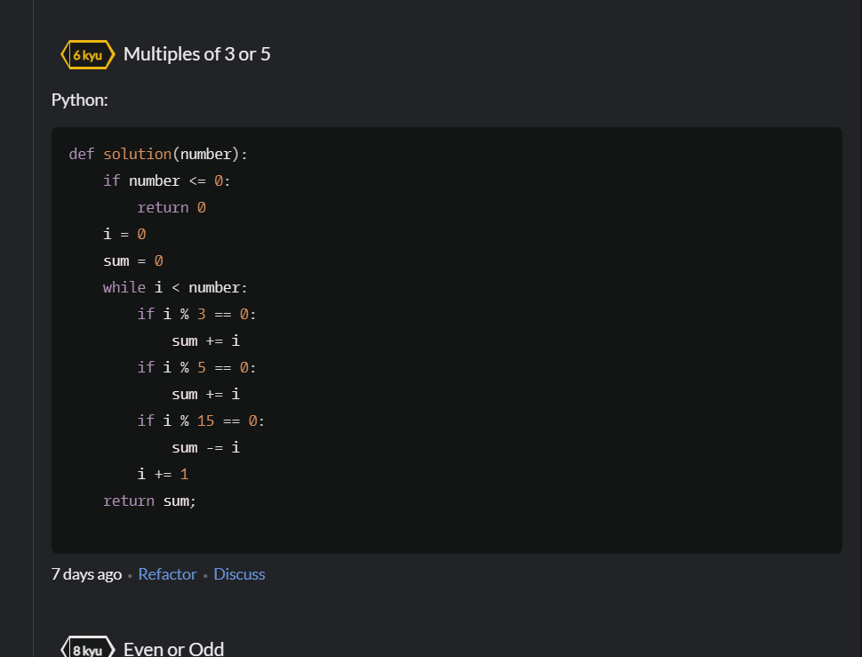
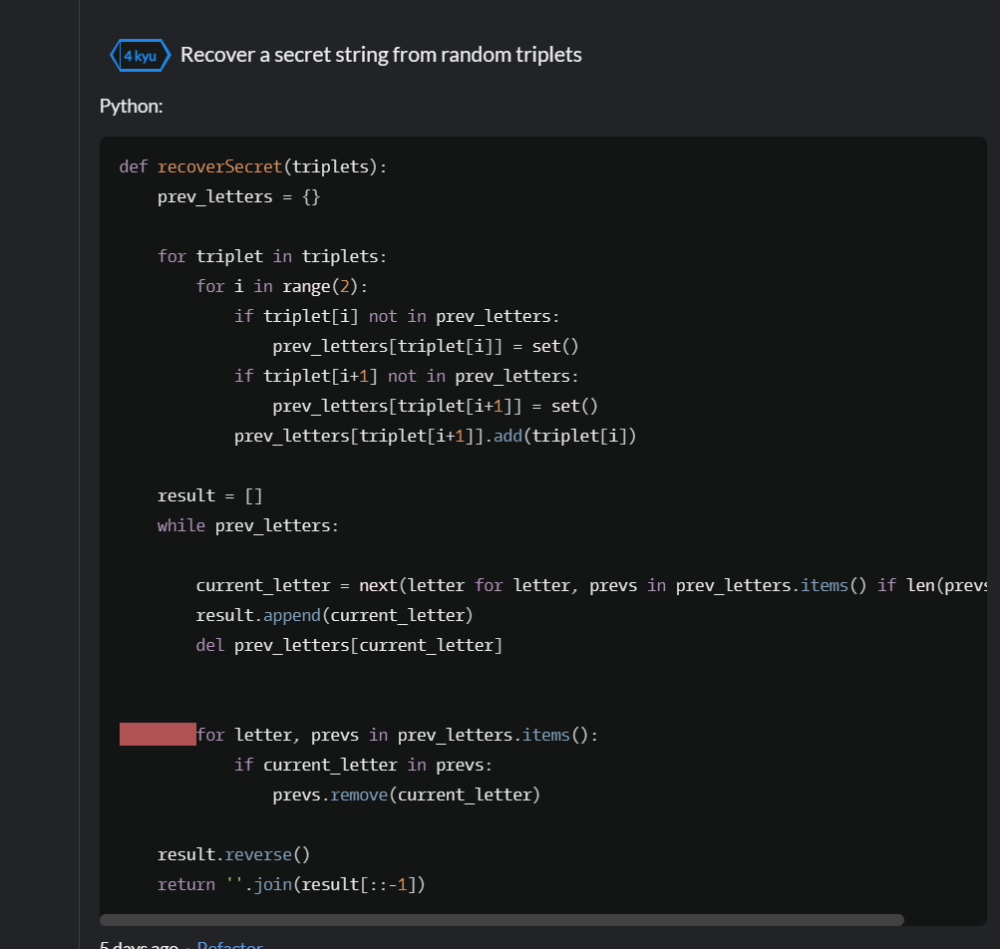
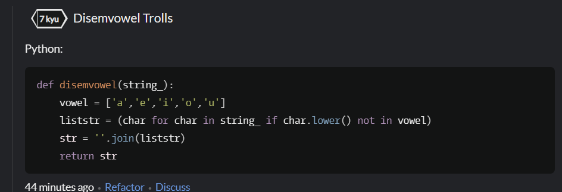

# 实验三 Python列表

班级： 21计科1

学号： 202302200000

姓名： 张三

Github地址：<https://github.com/yourusername/python_course>

CodeWars地址：<https://www.codewars.com/users/yourusername>

---

## 实验目的

1. 学习Python的简单使用和列表操作
2. 学习Python中的if语句

## 实验环境

1. Git
2. Python 3.10
3. VSCode
4. VSCode插件

## 实验内容和步骤

### 第一部分

Python列表操作

完成教材《Python编程从入门到实践》下列章节的练习：

- 第3章 列表简介
- 第4章 操作列表
- 第5章 if语句

---

### 第二部分

在[Codewars网站](https://www.codewars.com)注册账号，完成下列Kata挑战：

---

#### 第一题：3和5的倍数（Multiples of 3 or 5）

难度： 6kyu

如果我们列出所有低于 10 的 3 或 5 倍数的自然数，我们得到 3、5、6 和 9。这些数的总和为 23. 完成一个函数，使其返回小于某个整数的所有是3 或 5 的倍数的数的总和。此外，如果数字为负数，则返回 0。

注意：如果一个数同时是3和5的倍数，应该只被算一次。

**提示：首先使用列表解析得到一个列表，元素全部是3或者5的倍数。
使用sum函数可以获取这个列表所有元素的和.**

代码提交地址：
<https://www.codewars.com/kata/514b92a657cdc65150000006>

---

#### 第二题： 重复字符的编码器（Duplicate Encoder）

难度： 6kyu

本练习的目的是将一个字符串转换为一个新的字符串，如果新字符串中的每个字符在原字符串中只出现一次，则为"("，如果该字符在原字符串中出现多次，则为")"。在判断一个字符是否是重复的时候，请忽略大写字母。

例如:

```python
"din"      =>  "((("
"recede"   =>  "()()()"
"Success"  =>  ")())())"
"(( @"     =>  "))(("
```

代码提交地址:
<https://www.codewars.com/kata/54b42f9314d9229fd6000d9c>

---

#### 第三题：括号匹配（Valid Braces）

难度：6kyu

写一个函数，接收一串括号，并确定括号的顺序是否有效。如果字符串是有效的，它应该返回True，如果是无效的，它应该返回False。
例如：

```python
"(){}[]" => True 
"([{}])" => True
 "(}" => False
 "[(])" => False 
"[({})](]" => False
```

**提示：
python中没有内置堆栈数据结构，可以直接使用`list`来作为堆栈，其中`append`方法用于入栈，`pop`方法可以出栈。**

代码提交地址
<https://www.codewars.com/kata/5277c8a221e209d3f6000b56>

---

#### 第四题： 从随机三元组中恢复秘密字符串(Recover a secret string from random triplets)

难度： 4kyu

有一个不为你所知的秘密字符串。给出一个随机三个字母的组合的集合，恢复原来的字符串。

这里的三个字母的组合被定义为三个字母的序列，每个字母在给定的字符串中出现在下一个字母之前。"whi "是字符串 "whatisup "的一个三个字母的组合。

作为一种简化，你可以假设没有一个字母在秘密字符串中出现超过一次。

对于给你的三个字母的组合，除了它们是有效的三个字母的组合以及它们包含足够的信息来推导出原始字符串之外，你可以不做任何假设。特别是，这意味着秘密字符串永远不会包含不出现在给你的三个字母的组合中的字母。

测试用例：

```python
secret = "whatisup"
triplets = [
  ['t','u','p'],
  ['w','h','i'],
  ['t','s','u'],
  ['a','t','s'],
  ['h','a','p'],
  ['t','i','s'],
  ['w','h','s']
]
test.assert_equals(recoverSecret(triplets), secret)
```

代码提交地址：
<https://www.codewars.com/kata/53f40dff5f9d31b813000774/train/python>

提示：

- 利用集合去掉`triplets`中的重复字母，得到字母集合`letters`，最后的`secret`应该由集合中的字母组成，`secret`长度也等于该集合。

```python
letters = {letter for triplet in triplets for letter in triplet }
length = len(letters)
```

- 创建函数`check_first_letter(triplets, first_letter)`，检测一个字母是不是secret的首字母，返回True或者False。
- 创建函数`remove_first_letter(triplets, first_letter)`,  从三元组中去掉首字母，返回新的三元组。
- 遍历字母集合letters，利用上面2个函数得到最后的结果`secret`。

---

#### 第五题： 去掉喷子的元音（Disemvowel Trolls）

难度： 7kyu

喷子正在攻击你的评论区!
处理这种情况的一个常见方法是删除喷子评论中的所有元音(字母：a,e,i,o,u)，以消除威胁。
你的任务是写一个函数，接收一个字符串并返回一个去除所有元音的新字符串。
例如，字符串 "This website is for losers LOL!"   将变成 "Ths wbst s fr lsrs LL!".

注意：对于这个Kata来说，y不被认为是元音。
代码提交地址：
<https://www.codewars.com/kata/52fba66badcd10859f00097e>

提示：

- 首先使用列表解析得到一个列表，列表中所有不是元音的字母。
- 使用字符串的join方法连结列表中所有的字母，例如：

```python
last_name = "lovelace"
letters = [letter for letter in last_name ]
print(letters) # ['l', 'o', 'v', 'e', 'l', 'a', 'c', 'e']
name = ''.join(letters) # name = "lovelace"
```

---

### 第三部分

使用Mermaid绘制程序流程图

安装VSCode插件：

- Markdown Preview Mermaid Support
- Mermaid Markdown Syntax Highlighting

使用Markdown语法绘制你的程序绘制程序流程图（至少一个），Markdown代码如下：


显示效果如下：

```mermaid
flowchart LR
    A[Start] --> B{Is it?}
    B -->|Yes| C[OK]
    C --> D[Rethink]
    D --> B
    B ---->|No| E[End]
```

查看Mermaid流程图语法-->[点击这里](https://mermaid.js.org/syntax/flowchart.html)

使用Markdown编辑器（例如VScode）编写本次实验的实验报告，包括[实验过程与结果](#实验过程与结果)、[实验考查](#实验考查)和[实验总结](#实验总结)，并将其导出为 **PDF格式** 来提交。

## 实验过程与结果
### 第二部分
#### 第一题：3和5的倍数
```python
def solution(number):
    if number <= 0:
        return 0
    i = 0
    sum = 0
    while i < number:
        if i % 3 == 0:
            sum += i
        if i % 5 == 0:
            sum += i
        if i % 15 == 0:
            sum -= i
        i += 1
    return sum
```

#### 第二题：重复字符编码器
```python
def duplicate_encode(word):
    word = word.lower()
    result = ""
    for char in word:
        if word.count(char) == 1:
            result += "("
        else :
            result += ")"
    return result
```

#### 第三题：括号匹配
```python
def valid_braces(string):
    stack = []
    for char in string:
        if char in "([{":
            stack.append(char)
        elif char in ")}]":
            if not stack:
                return False
            top = stack.pop()
            if (char == ")" and top != "(") or (char == "}" and top != "{") or (char == "]" and top != "["):
                return False
    return len(stack) == 0
```

#### 第四题：三元组解码
```python
def recoverSecret(triplets):
    prev_letters = {}

    for triplet in triplets:
        for i in range(2):
            if triplet[i] not in prev_letters:
                prev_letters[triplet[i]] = set()
            if triplet[i+1] not in prev_letters:
                prev_letters[triplet[i+1]] = set()
            prev_letters[triplet[i+1]].add(triplet[i])

    result = []
    while prev_letters:

        current_letter = next(letter for letter, prevs in prev_letters.items() if len(prevs) == 0)
        result.append(current_letter)
        del prev_letters[current_letter]

     
        for letter, prevs in prev_letters.items():
            if current_letter in prevs:
                prevs.remove(current_letter)
                
    return ''.join(result[::])
```

#### 第五题：去掉喷子的元音
```python
def disemvowel(string_):
    vowel = ['a','e','i','o','u']
    liststr = (char for char in string_ if char.lower() not in vowel)
    str = ''.join(liststr)
    return str
```

### 第三部分
```mermaid
flowchart TB
    A(开始)-->B{number是否小于等于0}
    B -->|是| C[while循环，i自加，i是否小于number]
    B -->|否| D(返回0)
    C -->|是| E{i小于NUMBER}
    E -->|是| F{i是否为3的倍数}
    F -->|否| C
    E ------->|否| G(返回sum)
    F -->|是| H[sum+1]
    H -->I{是否是5的倍数}
    I -->|否| C
    I -->|是| J[sum+1]
    J --> K{i是否是15的倍数}
    K -->|是| L[sum—1]
    K -->|否| C
    L --> C
```

## 实验考查
请使用自己的语言并使用尽量简短代码示例回答下面的问题，这些问题将在实验检查时用于提问和答辩以及实际的操作。

1. Python中的列表可以进行哪些操作？
  答：python中的列表可以进行修改、添加和删除元素，可以对列表进行临时排序和永久排序。
2. 哪两种方法可以用来对Python的列表排序？这两种方法有和区别？
  答：sort()与sorted()方法都可以对列表进行排序，但sort()方法是永久排序，无法恢复到原始顺序，sorted()方法则是临时排序，不改变列表中元素的顺序。
3. 如何将Python列表逆序打印？
  答：可以在打印列表时在列表后加后缀.reverse来逆序打印列表。
4. Python中的列表执行哪些操作时效率比较高？哪些操作效率比较差？是否有类似的数据结构可以用来替代列表？
   答：列表执行访问元素、添加或删除末尾元素、切片时效率较高；而添加和删除元素、查找元素时效率较低，可以用数组、链表、集合来代替列表的作用。
5. 阅读《Fluent Python》Chapter 2. An Array of Sequence - Tuples Are Not Just Immutable Lists小节（p30-p35）。总结该小节的主要内容。
   答：该小节主要介绍了python中元组的性质和对元组的操作并给出了例子。

## 实验总结
本次实验我主要学习了python中列表的知识，学会了对列表的基本操作、了解了列表的性质和if函数的作用并且简单实践了列表和if函数的运用。