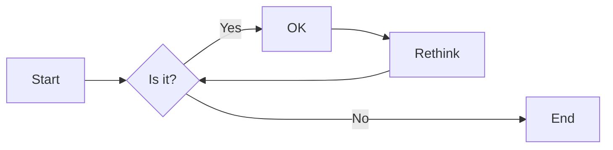
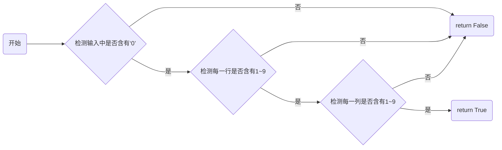

# 实验五 Python数据结构与数据模型

班级： 21计科03

学号： B20210302325

姓名： 欧阳浩

Github地址：<https://github.com/0hh4o/python_course>

CodeWars地址：<https://www.codewars.com/users/0hh4o>

---

## 实验目的

1. 学习Python数据结构的高级用法
2. 学习Python的数据模型

## 实验环境

1. Git
2. Python 3.10
3. VSCode
4. VSCode插件

## 实验内容和步骤

### 第一部分

在[Codewars网站](https://www.codewars.com)注册账号，完成下列Kata挑战：

---

#### 第一题：停止逆转我的单词

难度： 6kyu

编写一个函数，接收一个或多个单词的字符串，并返回相同的字符串，但所有5个或更多的字母单词都是相反的（就像这个Kata的名字一样）。传入的字符串将只由字母和空格组成。只有当出现一个以上的单词时，才会包括空格。
例如：

```python
spinWords( "Hey fellow warriors" ) => returns "Hey wollef sroirraw" 
spinWords( "This is a test") => returns "This is a test" 
spinWords( "This is another test" )=> returns "This is rehtona test"
```

代码提交地址：
<https://www.codewars.com/kata/5264d2b162488dc400000001>

提示：

- 利用str的split方法可以将字符串分为单词列表
例如：

```python
words = "hey fellow warrior".split()
# words should be ['hey', 'fellow', 'warrior']
```

- 利用列表推导将长度大于等于5的单词反转(利用切片word[::-1])
- 最后使用str的join方法连结列表中的单词。

---

#### 第二题： 发现离群的数(Find The Parity Outlier)

难度：6kyu

给你一个包含整数的数组（其长度至少为3，但可能非常大）。该数组要么完全由奇数组成，要么完全由偶数组成，除了一个整数N。请写一个方法，以该数组为参数，返回这个 "离群 "的N。

例如：

```python
[2, 4, 0, 100, 4, 11, 2602, 36]
# Should return: 11 (the only odd number)

[160, 3, 1719, 19, 11, 13, -21]
# Should return: 160 (the only even number)
```

代码提交地址：
<https://www.codewars.com/kata/5526fc09a1bbd946250002dc>

---

#### 第三题： 检测Pangram

难度：6kyu

pangram是一个至少包含每个字母一次的句子。例如，"The quick brown fox jumps over the lazy dog "这个句子就是一个pangram，因为它至少使用了一次字母A-Z（大小写不相关）。

给定一个字符串，检测它是否是一个pangram。如果是则返回`True`，如果不是则返回`False`。忽略数字和标点符号。
代码提交地址：
<https://www.codewars.com/kata/545cedaa9943f7fe7b000048>

---

#### 第四题： 数独解决方案验证

难度：6kyu

数独背景

数独是一种在 9x9 网格上进行的游戏。游戏的目标是用 1 到 9 的数字填充网格的所有单元格，以便每一列、每一行和九个 3x3 子网格（也称为块）中的都包含数字 1 到 9。更多信息请访问：<http://en.wikipedia.org/wiki/Sudoku>

编写一个函数接受一个代表数独板的二维数组，如果它是一个有效的解决方案则返回 true，否则返回 false。数独板的单元格也可能包含 0，这将代表空单元格。包含一个或多个零的棋盘被认为是无效的解决方案。棋盘总是 9 x 9 格，每个格只包含 0 到 9 之间的整数。

代码提交地址：
<https://www.codewars.com/kata/63d1bac72de941033dbf87ae>

---

#### 第五题： 疯狂的彩色三角形

难度： 2kyu

一个彩色的三角形是由一排颜色组成的，每一排都是红色、绿色或蓝色。连续的几行，每一行都比上一行少一种颜色，是通过考虑前一行中的两个相接触的颜色而产生的。如果这些颜色是相同的，那么新的一行就使用相同的颜色。如果它们不同，则在新的一行中使用缺失的颜色。这个过程一直持续到最后一行，只有一种颜色被生成。

例如：
```python
Colour here:            G G        B G        R G        B R
Becomes colour here:     G          R          B          G
```


一个更大的三角形例子：

```python
R R G B R G B B
 R B R G B R B
  G G B R G G
   G R G B G
    B B R R
     B G R
      R B
       G
```

你将得到三角形的第一行字符串，你的工作是返回最后的颜色，这将出现在最下面一行的字符串。在上面的例子中，你将得到 "RRGBRGBB"，你应该返回 "G"。
限制条件： 1 <= length(row) <= 10 ** 5
输入的字符串将只包含大写字母'B'、'G'或'R'。

例如：

```python
triangle('B') == 'B'
triangle('GB') == 'R'
triangle('RRR') == 'R'
triangle('RGBG') == 'B'
triangle('RBRGBRB') == 'G'
triangle('RBRGBRBGGRRRBGBBBGG') == 'G'
```

代码提交地址：
<https://www.codewars.com/kata/5a331ea7ee1aae8f24000175>

提示：请参考下面的链接，利用三进制的特点来进行计算。
<https://stackoverflow.com/questions/53585022/three-colors-triangles>

---

### 第二部分

使用Mermaid绘制程序流程图

安装VSCode插件：

- Markdown Preview Mermaid Support
- Mermaid Markdown Syntax Highlighting

使用Markdown语法绘制你的程序绘制程序流程图（至少一个），Markdown代码如下：


显示效果如下：



查看Mermaid流程图语法-->[点击这里](https://mermaid.js.org/syntax/flowchart.html)

使用Markdown编辑器（例如VScode）编写本次实验的实验报告，包括[实验过程与结果](#实验过程与结果)、[实验考查](#实验考查)和[实验总结](#实验总结)，并将其导出为 **PDF格式** 来提交。

## 实验过程与结果
### 第一部分
#### 第一题：停止逆转我的单词
代码如下：
```python
def spin_words(sentence):
    words = sentence.split(' ')
    rsentence = []
    for word in words:
        if len(word) >= 5:
            rword = word[::-1]
            rsentence.append(rword)
        else:
            rsentence.append(word)
    print(rsentence)
    return (' '.join(rsentence))
```
#### 第二题：发现离群的数(Find The Parity Outlier)
代码如下：
```python
def find_outlier(integers):
    evencount = 0
    oddcount =0
    for inte in integers:
        if inte % 2 == 1:
            oddcount += 1
        else:
            evencount += 1
    if oddcount == 1:
        for inte in integers:
            if inte % 2 == 1:
                return inte
    else:
        for inte in integers:
            if inte % 2 == 0:
                return inte
```
#### 第三题：检测pangram
代码如下：
```python
def is_pangram(s):
    pangram = {'A', 'B', 'C', 'D', 'E', 'F', 'G', 'H', 'I', 'J', 'K', 'L', 'M', 'N', 'O', 'P', 'Q', 'R', 'S', 'T', 'U', 'V', 'W', 'X', 'Y', 'Z'}
    p = set()
    for char in s:
        if char.isalpha():
            p.add(char.title())
    if p == pangram:
        return True
    else:
        return False
```
#### 第四题：数独解决方案验证
代码如下：
```python
def validate_sudoku(board):
    #检查是否含有0
    for list in board:
        for num in list:
            if num == 0:
                return False
    
    # 检查行
    for row in board:
        if not is_valid_row(row):
            return False
    
    # 检查列
    for col in range(9):
        column = [board[row][col] for row in range(9)]
        if not is_valid_row(column):
            return False
    
    # 检查3x3子网格
    for i in range(0, 9, 3):
        for j in range(0, 9, 3):
            subgrid = [board[row][col] for row in range(i, i+3) for col in range(j, j+3)]
            if not is_valid_row(subgrid):
                return False
    
    return True

def is_valid_row(row):
    # 统计每个数字的出现次数
    count = [0] * 10
    for num in row:
        count[num] += 1
    
    # 检查是否有任何数字出现超过一次
    for i in range(1, 10):
        if count[i] > 1:
            return False
    
    return True
```
#### 第五题：疯狂的彩色三角形
代码如下：
```python
import numpy as np

MAX_N_LOG_3 = 100  # Define this constant as per your requirement
fac = [1, 1, 2]
def C(n, m): # inv(x)==x
	return 0 if n<m else fac[n]*fac[m]*fac[n-m]%3
def Lucas(n, m):
	ans = 1
	while m and ans:
		ans, n, m = ans*C(n%3, m%3)%3, n//3, m//3
	return ans
def triangle(row):
	i, ans, n = 0, 0, len(row)-1
	if not n: return row
	for c in row:
		ans, i = ans+(0 if c=='R' else 1 if c=='G' else 2)*Lucas(n,i), i+1
	ans=(3-ans%3 if n&1 else ans)%3
	return 'R' if ans==0 else 'G' if ans==1 else 'B'
```
### 第二部分：

## 实验考查

请使用自己的语言并使用尽量简短代码示例回答下面的问题，这些问题将在实验检查时用于提问和答辩以及实际的操作。

1. 集合（set）类型有什么特点？它和列表（list）类型有什么区别？
答：集合是无序的，且集合不允许存在重复元素，集合中只能存储不可变类型的元素；列表是有序的且允许存在重复元素，列表中的元素可以是任意类型。
2. 集合（set）类型主要有那些操作？
答：集合的操作主要包括了集合的创建、添加元素、移除元素、判断存在的in函数、遍历、清空、复制和集合运算。
3. 使用`*`操作符作用到列表上会产生什么效果？为什么不能使用`*`操作符作用到嵌套的列表上？使用简单的代码示例说明。
答：在Python中，使用*操作符作用到列表上会产生重复的效果，即将列表中的元素重复指定的次数。这意味着列表中的元素会被复制多次，并生成一个新的列表。
例如，如果我们有一个列表[1, 2, 3]，并将*操作符应用于该列表，如[1, 2, 3] * 3，将会生成一个新的列表[1, 2, 3, 1, 2, 3, 1, 2, 3]，其中原始列表中的元素被重复了三次。
然而，*操作符不能直接作用于嵌套的列表上，因为它只复制了嵌套列表的引用，而不是嵌套列表的内容。这意味着复制的结果是多个指向同一个嵌套列表的引用，而不是多个独立的嵌套列表。
例如，考虑以下代码示例：
nested_list = [[1, 2], [3, 4]]
duplicated_list = nested_list * 3
print(duplicated_list)
输出结果为[[1, 2], [3, 4], [1, 2], [3, 4], [1, 2], [3, 4]]，可以看到重复的结果是多个指向同一个嵌套列表的引用。
如果我们修改其中一个嵌套列表的元素，会发现所有重复的列表都会受到影响，因为它们实际上是同一个列表的引用：
nested_list[0][0] = 5
print(duplicated_list)
输出结果为[[5, 2], [3, 4], [5, 2], [3, 4], [5, 2], [3, 4]]，可以看到所有重复的列表中的第一个元素都被修改了。
4. 总结列表,集合，字典的解析（comprehension）的使用方法。使用简单的代码示例说明。
答：列表、集合的解析的使用方法差不多，都为’expression for item in iterable if condition‘，只是套的括号不一样；字典的解析的使用方法为：{key_expression: value_expression for item in iterable if condition}
实例代码如下：
```python
# 生成一个包含1到10的平方的列表
squares = [x**2 for x in range(1, 11)]
print(squares)  # 输出: [1, 4, 9, 16, 25, 36, 49, 64, 81, 100]

# 生成一个包含偶数的列表
numbers = [x for x in range(1, 11) if x % 2 == 0]
print(numbers)  # 输出: [2, 4, 6, 8, 10]
#以上是列表的解析

# 生成一个包含1到10的平方的集合
squares = {x**2 for x in range(1, 11)}
print(squares)  # 输出: {64, 1, 4, 36, 100, 9, 16, 49, 81, 25}

# 生成一个包含偶数的集合
numbers = {x for x in range(1, 11) if x % 2 == 0}
print(numbers)  # 输出: {2, 4, 6, 8, 10}
#以上是集合的解析

# 生成一个包含1到10的数字及其平方的字典
squares = {x: x**2 for x in range(1, 11)}
print(squares)  # 输出: {1: 1, 2: 4, 3: 9, 4: 16, 5: 25, 6: 36, 7: 49, 8: 64, 9: 81, 10: 100}

# 生成一个包含偶数及其平方的字典
numbers = {x: x**2 for x in range(1, 11) if x % 2 == 0}
print(numbers)  # 输出: {2: 4, 4: 16, 6: 36, 8: 64, 10: 100}
#以上是字典的解析
```
## 实验总结
这次实验中我学到了python的数据类型的一些高级用法，还学习了怎么优化代码的运行速度，但第五题我还暂时不能理解它的算法，在查阅一些资料后我会努力理解它。
